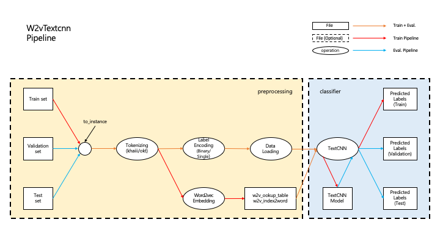

# deep-text-classification

딥러닝 텍스트 분류 API

사용하고자 하는 모델에 따라 파이프라인을 구성하여 손쉽게 실험을 할 수 있도록 만든 딥러닝 텍스트 분류 API입니다.

## 모델

- D2vMlp
- D2vMlpDropout
- W2vTextcnn
- W2vTextcnnRegularized
- Bert

### 코드 설명

- utils.py: 데이터 관리, 모델 학습과 관련된 함수
  -  Instance
  - to_instances()
  - Pipeline
  - train()
  - evaluate()
  - predict()
  - EarlyStopping
- tokenizing.py: 텍스트 토크나이징
  - BaseTokenizing
  - KhaiiiTokenizing
  - OktTokenizing
  - WpmTokenizing
- embedding.py: Doc2vec, Word2vec 등 pre-training 단계
  - D2vEmbedding
  - W2vEmbedding
- label_encoding.py: 데이터의 label을 cost function에 맞게 encoding
  - BaseLabelEncoding
  - BinaryLabelEncoding
  - SingleLabelEncoding
- data_loading.py: 모델 학습을 위한 Input을  pytorch dataset, dataloader로 변환
  - BaseDataLoading
  - D2vMlpDataLoading
  - TextcnnDataLoading
  - BertDataLoading
- layers.py: Doc2vec, TextCNN, BERT 등 모델별 각 layer module
  - MlpLayer
  - MlpDropoutLayer
  - W2vEmbeddingLayer
  - TextcnnLayer
  - TextcnnRegularizedLayer
  - BertEmbeddingLayer
  - MultiHeadedSelfAttentionLayer
  - LayerNormLayer
  - PositionWiseFeedForwardLayer
  - BlockLayer
  - TransformerLayer
  - Word/SentAttention

### 사용 예시

링크: [EXAMPLE.md](./EXAMPLE.md)

### 파이프라인 예시

</img>

